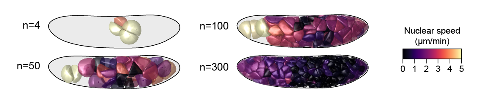

## Code accompanying _Local density determines nuclear movements during syncytial blastoderm formation in a cricket_
# [bioRxiv Link]()
`REPOSITORY IS IN PROGRESS. CHECK BACK SOON.`

By [Seth Donoughe](https://www.sethdonoughe.com/), [Jordan Hoffmann](https://jhoffmann.org/), [Taro Nakamura](http://www.nibb.ac.jp/niimilab/), [Christopher H. Rycroft](https://people.seas.harvard.edu/~chr/), and [Cassandra Extavour](https://www.extavourlab.com/)

### `ilastik` to `MaMuT`
[Mathematica](https://www.wolfram.com/mathematica/) code to convert [ilastik](https://www.ilastik.org/) tracks to [MaMuT](https://imagej.net/MaMuT) for manual correction is included in `Convert_Ilastik_to_Mamut.nb`. 
This code has not been tested with the most recent version of either `ilastik` or `MaMuT`.

### Main Simulation Requirements

The code uses `numpy` and `scipy`. Additionally, we use `scikit-fmm` [GitHub Link](https://github.com/scikit-fmm/scikit-fmm) [PyPI Link](https://pypi.org/project/scikit-fmm/).

### Code Output

The code outputs `csv` files that contain positions through time and the time since the last division. 
The code can also output individual shells or an auxilliary file useful for tracking the fate of individual nuclei. 
When nuclei divide, one daughter takes the index of the original nucleus, and another is added at the end. 

### Potential Code Modifications
`IN PROGRESS. CHECK BACK SOON`

* How to change the geometry.

* How to change the shell size.

* How to plot the results.

* How to render the shells.

See [here](https://github.com/hoffmannjordan/Insect-Development-Model) for a _Mathematica_ notebook that can be used to generate a [POV-ray](http://www.povray.org/) file.

